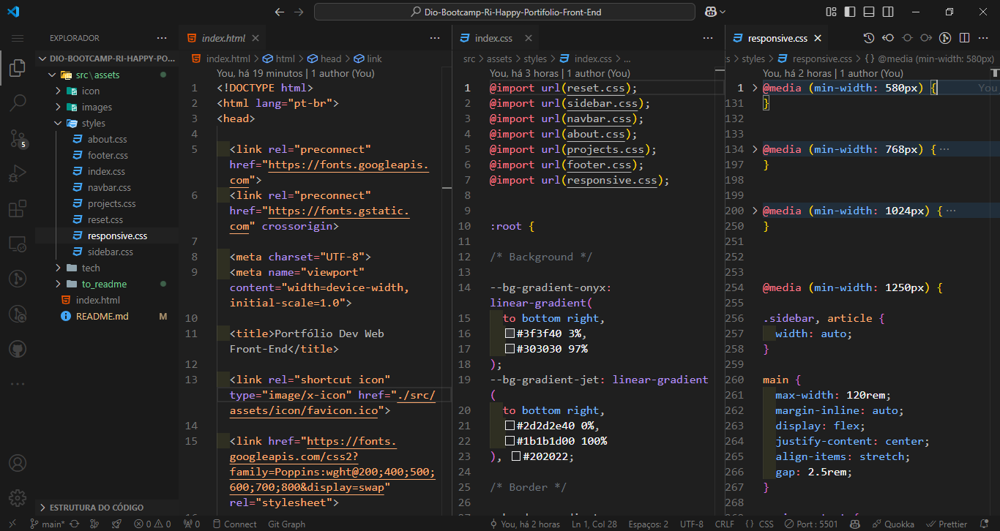

# Dio-Bootcamp_Ri-Happy - Portfólio Front-End

Este projeto é uma página inspirada no Mundo Invertido de Stranger Things, apresentada pelos instrutores da DIO, Michele Ambrosio e Diogo Mainardes, como parte do Bootcamp Ri-Happy - Front-end do Zero. O objetivo principal é explorar as possibilidades de estilização com CSS, juntamente com a aplicação de lógica de programação em JavaScript, para criar uma experiência interativa e envolvente. O projeto destaca a manipulação do DOM, integrando recursos dinâmicos e criativos, resultando em uma aplicação funcional e divertida.

## Página de registro das informações sobre o Mundo Invertido Stranger Things

### 📜 Sobre o Projeto

### 🔗 Links Úteis

- 

- 

### ✅ Status do Projeto

**Em Desenvolvimento**

### 🎥 Deploy

  

#### Gif da Página do Portfólio 

  

#### Tela Inicial Portfólio 

  

#### Tela do código do Código

  

### 🧩 Desafio

  

### 📝 Requisitos da Aplicação

| Item  | Descrição                                                                       |
|-------|---------------------------------------------------------------------------------|
|  1    | A página deve ser desenvolvida em HTML, CSS e Javascript                        |
|  1.1  | Base de design no Figma:                                                        |
|  2    | Modelagem do layout, formatos, tipografias, cores e organização livre.          |

### 🚀 Plano do Projeto

No desenvolvimento desta página, foram aplicados os seguintes conceitos:

| Item  | Descrição                                   |
|-------|---------------------------------------------|
|  1    | HTML                                        |
|  2    | CSS                                         |
|  3    | Javascript                                  |

### 🛠 Tecnologias Utilizadas

- **Visual Studio Code**
- **HTML**
- **CSS**
- **Javascript**
- **Documentação**
- **ChatGpt**

### 💡 Reflexões

### 📦 Como Executar o Projeto

1. Clone o repositório:
   
    git clone https://github.com/ricardo-werner/Dio-Bootcamp-Ri-Happy-Portifolio-Front-End.git

3. Abra o projeto no Visual Studio Code e ative o Go Live:
    
   

     
   

   

     
   

4. Visualize o resultado na página web:

   

     
   

### 🙋‍♂️ Autor
Ricardo Werner 
Dev em Desenvolvimento
